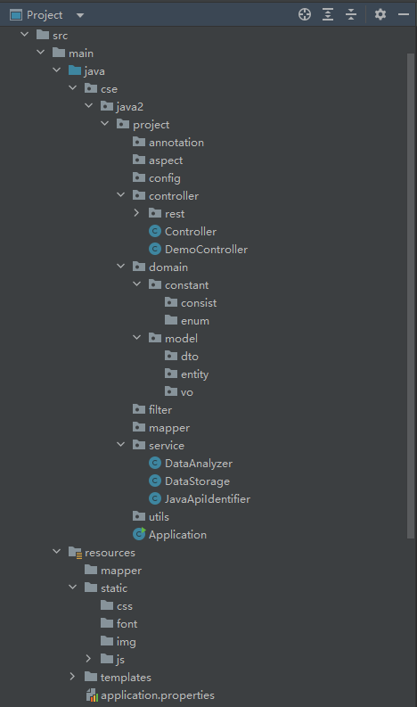

# 2023/04/26

### SpringBoot

https://zhuanlan.zhihu.com/p/115403195

https://juejin.cn/post/7041767631992389645

https://www.jianshu.com/p/ffab3013e1d2

### mybatis

https://juejin.cn/post/7201831345415749692#heading-54

### 现在的项目结构



### StackOverflow的API key

# SUSTech-2023-Spring-Java2-Project

### Client Id

26107

This Id identifies your application to the Stack Exchange API. Your application client id is **not** secret, and may be safely embeded in distributed binaries.

Pass this as in [our OAuth 2.0 flow](https://api.stackexchange.com/docs/authentication). `client_id`

### Client Secret ([reset](https://stackapps.com/apps/oauth/view/26107#))

1xST3StwUaKctIk6q1UMtw((

Pass this as in [our OAuth 2.0 flow](https://api.stackexchange.com/docs/authentication) if your app uses the explicit path.

This **must be** kept secret. Do not embed it in client side code or binaries you intend to distribute. If you need client side authentication, use the implicit OAuth 2.0 flow. `client_secret`

### Key

qeUQ3LQJnDuzdfxTekiPSg((

Pass this as when making requests against the Stack Exchange API to receive a [higher request quota](https://api.stackexchange.com/docs/throttle).

This is not considered a secret, and may be safely embed in client side code or distributed binaries. `key`

### Description

SUSTech-2023-Spring-Java2-Project

This **text-only** blurb will be shown to users during authentication.

### OAuth Domain

github.com/jimmylaw21/2023-Spring-Java2-Project

Whenever a redirect occurs during an [authentication sessions](https://api.stackexchange.com/docs/authentication) (as specified by ) it must reside under this domain.

For the purposes of redirection, subdomains are considered to be under their parent domain. Registering would allow a redirect_uri of for example. `redirect_uri``example.com``foo.example.com`

### Application Website

https://github.com/jimmylaw21/2023-Spring-Java2-Project

A link to this website will accompany most displays of your application on the Stack Exchange network.

### Application Icon

Not Set

This image will accompany most displays of your application on the Stack Exchange network.

### Stack Apps Post

Not Set

When you've published your application, it should be listed on Stack Apps with the [app](https://stackapps.com/questions/tagged/app) or [script](https://stackapps.com/questions/tagged/script) tags.

### Client Side Flow Is Disabled

An application can either be configured for client side or server side authentication flows.

Changing to one will disable the other flow.

### Desktop OAuth Redirect Uri Is Enabled

Applications that have the client side flow enabled can use as their by default.

This is provided so non-web clients can participate in OAuth 2.0 without requiring a full fledged web server. Applications that do not need this behavior can disable it. `https://stackexchange.com/oauth/login_success``redirect_uri`

[Edit this app](https://stackapps.com/apps/oauth/edit/26107)

# 2023/04/30

StackOverflowWrapper 是所有 API response的封装类/通用格式， 获取到的response都是这个类的对象的json格式

StackOverflowThread类型在StackOverflow api对象中不存在的，即不能直接获得，根据project文档，它其实是由一个问题及其附属答案和评论构成的。

所以在获取Thread时，需要先获取问题，再获取问题的附属答案和评论，然后将它们组合成一个StackOverflowThread对象。

Question，Answer，Comment可以直接获取，但是需要注意的是，获取Answer和Comment时，需要指定它们所属的问题的id，即question_id

获取时得到的是一个StackOverflowWrapper，其中的items是一个List，里面是Question，Answer或Comment等的对象

Owner是Question，Answer，Comment里面都包含的一个属性的类型

ThreadCollrctor是一个获取StackOverflowThread的工具类

ThreadCollrctorApp是一个使用ThreadCollrctor的类，里面有main函数，可以直接运行，拿到数据

但是我没有保存这些数据，接下来就交给你了(doge)

理想的数据持久层应该是使用mybatis框架，保存到数据库中，具体学习链接在26号的记录里，可以配合gpt食用：

MyBatis是一个用于处理数据库操作的Java持久层框架。它简化了SQL语句的编写和参数绑定过程，提供了一个简洁、灵活的方式来管理数据库操作。

要在Spring Boot项目中使用MyBatis，您需要按照以下步骤操作：

1. 添加MyBatis和数据库驱动的依赖

在`pom.xml`文件中添加MyBatis Spring Boot Starter和数据库驱动（例如MySQL）的依赖：

```
xmlCopy code<dependencies>
    <!-- Other dependencies -->
    <dependency>
        <groupId>org.mybatis.spring.boot</groupId>
        <artifactId>mybatis-spring-boot-starter</artifactId>
        <version>2.2.0</version>
    </dependency>
    <dependency>
        <groupId>mysql</groupId>
        <artifactId>mysql-connector-java</artifactId>
        <version>8.0.28</version>
    </dependency>
</dependencies>
```

2. 配置数据库连接

在`src/main/resources/application.properties`文件中配置数据库连接信息：

```
propertiesCopy codespring.datasource.url=jdbc:mysql://localhost:3306/your_database?useSSL=false&serverTimezone=UTC
spring.datasource.username=your_username
spring.datasource.password=your_password
spring.datasource.driver-class-name=com.mysql.cj.jdbc.Driver
```

3. 创建实体类

创建一个实体类，它将映射到数据库中的表。例如，如果您有一个名为`user`的表，可以创建一个名为`User`的实体类：

```
javaCopy codepublic class User {
    private Long id;
    private String username;
    private String email;
    // Getters and setters
}
```

4. 创建映射文件

创建一个映射文件，它将包含用于处理`User`实体的SQL语句。通常将映射文件放在`src/main/resources/mappers`文件夹中。例如，创建一个名为`UserMapper.xml`的文件：

```
xmlCopy code<?xml version="1.0" encoding="UTF-8" ?>
<!DOCTYPE mapper PUBLIC "-//mybatis.org//DTD Mapper 3.0//EN" "http://mybatis.org/dtd/mybatis-3-mapper.dtd">
<mapper namespace="com.example.mybatisdemo.mapper.UserMapper">
    <resultMap id="UserResultMap" type="com.example.mybatisdemo.model.User">
        <id property="id" column="id" />
        <result property="username" column="username" />
        <result property="email" column="email" />
    </resultMap>

    <select id="findAll" resultMap="UserResultMap">
        SELECT * FROM user
    </select>

    <!-- Other CRUD operations -->
</mapper>
```

5. 创建接口

创建一个接口，用于与映射文件交互。例如，创建一个名为`UserMapper`的接口：

```
javaCopy codepackage com.example.mybatisdemo.mapper;

import com.example.mybatisdemo.model.User;
import org.apache.ibatis.annotations.Mapper;
import org.springframework.stereotype.Repository;

import java.util.List;

@Mapper
@Repository
public interface UserMapper {
    List<User> findAll();
}
```

6. 在服务中使用接口

在服务类中，使用`UserMapper`接口执行数据库操作：

```
javaCopy code@Service
public class UserService {
    private final UserMapper userMapper;
    @Autowired
    public UserService(UserMapper userMapper) { this.userMapper = 		userMapper; }

	public List<User> findAll() {
	    return userMapper.findAll();
	}
	// Other CRUD operations and business logic
}
```


7. 控制器中使用服务

在控制器类中，使用`UserService`来处理来自客户端的请求：

```java
@RestController
@RequestMapping("/users")
public class UserController {
    private final UserService userService;

    @Autowired
    public UserController(UserService userService) {
        this.userService = userService;
    }

    @GetMapping
    public ResponseEntity<List<User>> findAll() {
        List<User> users = userService.findAll();
        return ResponseEntity.ok(users);
    }

    // Other CRUD operations and endpoints
}
```

现在，您已经在Spring Boot项目中成功集成了MyBatis，并可以使用它来处理数据库操作。这只是一个基本示例，MyBatis还提供了许多其他功能，如动态SQL、类型处理器、插件等。要了解更多关于MyBatis的信息，请查阅官方文档：https://mybatis.org/mybatis-3/

加油哦哦哦

# 2023/5/6

为了将Owner对象导入到owner表中，需要以下内容：

在mybatis的mapper XML文件中，编写针对Owner类的SQL语句，包括插入、更新、删除、查询等操作。

在mybatis的mapper XML文件中，编写Owner类的resultMap，将查询结果映射到Owner对象中。

编写对应的OwnerTypeHandler类，将Owner对象在Java对象和数据库字段之间进行转换。

在mybatis的配置文件中，将OwnerTypeHandler注册到typeHandlers中，以便mybatis能够自动将Owner对象转换为数据库字段，或者将数据库字段转换为Owner对象。

在代码中调用相应的方法，通过mybatis将Owner对象插入、更新、删除或查询出来。

--chatGPT3.5

StackOverflowThreadMapper是Mapper接口

StackOverflowThreadMapper.xml是Mapper XML映射文件

mybatis-config.xml是mybatis配置文件

application.properties中新增了待连接的数据库信息，你需要新建一个数据库，数据库名为threads,用户名为post，密码为123456 如果忘记怎么建了可以参考[Experiment 1 Software Installing.pdf](https://github.com/jimmylaw21/2023-Spring-Java2-Project/files/11412484/Experiment.1.Software.Installing.pdf)中的练习2，建表的sql文件也已上传。
